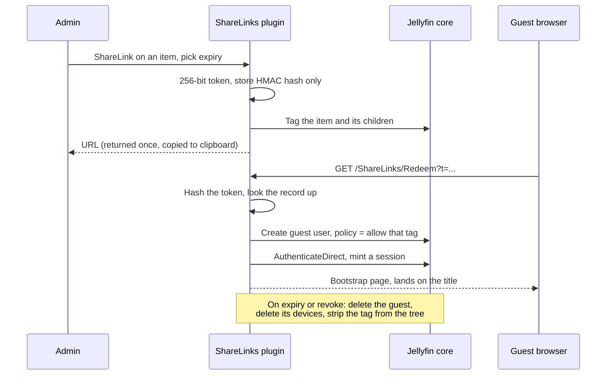

# ShareLinks for Jellyfin

Share a movie, episode, season or series with a link. The person you send it to does not need
an account and can only access what you shared. You choose when the link expires.

`Jellyfin 10.11` · `.NET 9` · `no account for the guest` · `access restricted on the server` · `automatic cleanup`

ShareLinks adds a **ShareLink** entry to the context menu of any movie, series, season or episode.
Choose an expiry date and copy the link. Whoever opens it goes straight to the shared title,
already signed in with a temporary account. When the link expires,
the account and the temporary tag are removed.


---

## Threat model

Guests receive a Jellyfin access token, which also works in mobile apps and other clients.
Hiding buttons in the browser would not stop someone from accessing the rest of your library.

The plugin restricts access on the server in two ways:

1. **Jellyfin's tag policy.** Every share creates a random tag, `sharelinks-<32 hex>`. The tag goes
   on the shared item and its children, such as the episodes in a season. The guest account can
   only access items with that tag. Other content is filtered out of library and search results.
2. **A request filter for plugin routes.** Jellyfin's own API stays available for playback,
   with access limited by the tag policy. Guests receive a 403 response from other plugins'
   routes unless an administrator explicitly allows access to that plugin.

The web client also hides the home, menu and search controls, disables cast and genre links,
and brings guests back to the shared title if they navigate away. This keeps the interface simple;
the server enforces the access restrictions even if someone disables the script.

Jellyfin has no server setting that keeps a user on one page. The plugin uses Jellyfin accounts
and tag permissions to control what guests can access, without a separate login system.

## Flow



1. **Create.** You choose an expiry from 1 hour to 7 days, or an exact date, capped by the
   configured maximum. You also choose single use, which is the default, or multi use.
2. **Tag.** The plugin tags the item and everything below it. Tagging never goes upwards: Jellyfin
   treats a parent's tags as belonging to all of its children, so tagging the series of a shared
   season would hand over every other season.
3. **Redeem.** Opening the link creates a temporary guest account, applies the access restrictions,
   and signs the visitor in. They go straight to the shared title.
4. **Clean up.** Expiry or revocation disables and deletes the guest account, removes its registered
   devices, and removes the tag from the shared items. Cleanup also runs on a schedule and at
   startup, so expired links are handled if the server was off.

## Design decisions

| Decision | Reason |
|---|---|
| Only the token HMAC hash is stored | The raw token is returned once and is never saved to disk. Lookups hash the presented token and compare with `FixedTimeEquals`. |
| The HMAC key is a per-server file, mode 0600 | The `sharelinks.json` file alone cannot be used to recover a token. The key is generated on first use. |
| Tags propagate down, never up | A bug fixed in 1.0.3: a shared season tagged its parent series, and Jellyfin's tag inheritance then exposed every other season of that series. |
| Guest accounts use a dedicated authentication provider | Guests cannot sign in through the login page with a password. If the plugin is disabled, Jellyfin also refuses those sign-ins. |
| The password is generated per redemption and thrown away | This prevents sign-in with a blank password. The browser receives only a session token. |
| Links are redeemed one request at a time | This prevents two simultaneous requests from both using the same single-use link. |
| Each multi-use viewer receives its own device id | Jellyfin logs out any session with the same user and device id, so a shared device id would kick out the previous viewer on every new arrival. |
| The viewer limit is checked before changing anything | Handling the limit before Jellyfin raises an error lets the plugin turn away a new viewer without interrupting anyone already watching. |
| Other plugins are blocked by default | The filter distinguishes Jellyfin core from plugin code, so newly installed plugins are blocked too. |
| Guest devices are deleted before the user | Jellyfin does not remove devices when a user is deleted. Leftover devices can break the admin devices page. |

## What the guest can do

- Watch the shared title, and browse down into it. A shared series opens into its seasons and
  episodes. A shared season opens into its episodes.
- Access only the shared content. Other plugins are blocked unless you allow them in the settings.
- Playback works normally, with transcoding and remuxing if you allow them.

Going up does not work. A guest who receives one season cannot open the series that contains it.

## Multi-use links

A multi-use link works for everyone you send it to until it expires. Anyone with the link can use it, so only send it to people you want to give access to.

- Every viewer uses the same account, so every viewer sees the same single title. More viewers do
  not mean more content.
- The limit, 10 by default, caps how many people **start** watching at the same time. It is not a
  cap on how many people use the link in total. Sessions end, and each redemption issues its own
  token. Revoke the link if you need a hard stop.
- One account means shared playback position and shared watch state. Use single-use links if that
  matters.
- A viewer over the limit receives a "try again later" page. Nobody watching is disturbed.

## Managing links

The plugin dashboard page lists every share with its status, title, copyable link, guest name and
expiry. You can revoke any link on the spot, which removes the guest account and tags, just like expiry. A cleanup
button removes revoked, expired and failed records from the store.

## Install

Add the repository in **Dashboard → Plugins → Manage repositories**:

```
https://raw.githubusercontent.com/Franciskid/jellyfin-plugin-sharelinks/main/manifest.json
```

Install **ShareLinks**, then restart Jellyfin. Hard-refresh the web client once for the menu entry
to appear.

## Configuration

| Setting | Effect | Default |
|---|---|---|
| Default expiry | The expiry the create popup offers first | 24 h |
| Maximum expiry | The longest allowed lifetime for a link | 720 h |
| Public base URL override | Forces the host used to build links, instead of the request host | derived |
| Guest username prefix | Prefix for the temporary accounts | `share-` |
| Allow transcoding / remuxing | Whether guest playback may transcode or remux | on |
| Cleanup interval | How often the background cleanup runs | 60 min |
| Maximum viewers per multi-use link | Concurrent viewers on one multi-use link. 0 means no limit | 10 |
| Single use by default | How the create popup starts | on |
| Guest lockdown | Hides navigation controls in the guest interface | on |
| Block other plugins for guests | Blocks guest access to other plugins on the server | on |
| Plugin access list | Plugins guests are allowed to access | empty |
| Cosmetic hidden selectors | Hides matching elements in the browser; does not restrict access | empty |

**On the plugin access list:** some plugins have to answer guests. An intro skipper, for example,
is called by the client during playback. Enable access for that plugin in the list. Plugins are blocked by default, including newly
installed ones.

**On the cosmetic selectors:** use these to hide elements such as another plugin's floating button.
This only changes what guests see in the browser. To restrict access, use the plugin access
settings above.

## HTTP API

| Endpoint | Auth | Purpose |
|---|---|---|
| `POST /ShareLinks/Admin/Create` | Admin | Create a link. Returns the raw URL once |
| `GET /ShareLinks/Admin/List` | Admin | All records with status and expiry |
| `POST /ShareLinks/Admin/Revoke/{id}` | Admin | Revoke a link and remove its guest account and tags |
| `POST /ShareLinks/Admin/Cleanup` | Admin | Remove revoked, expired and failed records |
| `GET /ShareLinks/Admin/Plugins` | Admin | Installed plugins and their guest access state |
| `GET /ShareLinks/GuestState` | Session | Whether the caller is a guest, and what to lock down |
| `GET /ShareLinks/Redeem?t=...` | none | Redeem a token, return the bootstrap page |
| `GET /ShareLinks/ClientScript` | none | The injected web-client script |

Records live in `sharelinks/sharelinks.json` under Jellyfin's data folder. The HMAC key lives beside
it in `token-secret.key`.

## Known limits

- **Cast and crew are missing on a shared page.** Jellyfin core bug
  [jellyfin/jellyfin#14926](https://github.com/jellyfin/jellyfin/issues/14926): a tag-restricted user
  loses the Cast & Crew section, because the tag filter is applied to people as well as to media. A
  ShareLinks guest is tag-restricted, so guests are affected too.
- **The token travels in the query string.** It appears in reverse-proxy access logs and in browser
  history.
- **Redemption is public and has no rate limit.** Tokens are 256-bit random, so guessing one is not
  realistic, but the endpoint answers anyone.
- **Episodes added after a share** receive the tag on the next redemption, not the moment they are
  added. A one-use link that was already redeemed is limited to the items present when it was redeemed.
- **Records are kept after they expire**, for audit. Remove them with the cleanup button.
- **The `sharelinks-` tag is hidden from non-admins in the web client only.** It stays in the API
  response, because Jellyfin uses that tag to restrict guest access.
- **The guest session token is a real Jellyfin token.** It can be misused in the ways any Jellyfin
  token can. Access is still limited to the shared content for the duration you set.

## Compatibility

Jellyfin **10.11** (`targetAbi 10.11.0.0`), .NET 9. Tested on 10.11.8 and 10.11.11. The web-client injection
targets the shipped client, in English and in French.

## Workflow

**1. Open the context menu on an item**


**2. Choose an expiry and the single-use option**


**3. Copy the link**


## License

Developed by [Franciskid](https://github.com/Franciskid). Licensed under the [GPL-3.0](LICENSE),
like most Jellyfin plugins.
